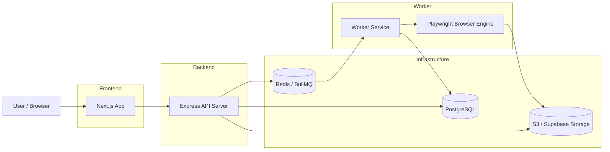

# BrowserOps

Secure browser-workflow automation platform that lets users describe repetitive website tasks in plain language and execute them through a real browser.

## Tech Stack

- **Frontend**: Next.js 14+ (App Router), React, TypeScript, Tailwind CSS, Framer Motion
- **Backend**: Node.js, Express.js, TypeScript, REST API
- **Database**: PostgreSQL with Prisma ORM
- **Automation**: Playwright
- **Queue/Background Jobs**: BullMQ and Redis
- **Monorepo Management**: pnpm workspaces

## 🏗️ System Architecture


## Getting Started

### Prerequisites

- Node.js (v18+)
- pnpm
- Redis (running locally or a cloud instance)
- PostgreSQL (running locally or a cloud instance)

### Local Development

1. **Install dependencies:**
   ```bash
   pnpm install
   ```

2. **Setup environment variables:**
   - Copy `.env.example` to `.env` in the root and configure secrets.
   - Configure `.env` files in `apps/api`, `apps/web`, and `apps/worker` as needed (using `http://localhost:4000` for API and `redis://localhost:6379` for Redis by default).

3. **Initialize Database:**
   ```bash
   cd packages/db
   npx prisma db push
   ```

4. **Run the development server:**
   ```bash
   pnpm dev
   ```

The dashboard will be available at `http://localhost:3000`.

## Core Features

- **Workflow Builder**: Define UI-based automation steps (click, type, navigate, wait).
- **Execution Engine**: Isolated browser runs with logs and screenshots.
- **Session Vault**: Securely store and reuse authenticated browser sessions.
- **Audit Trail**: Step-by-step logs and status tracking for every run.
